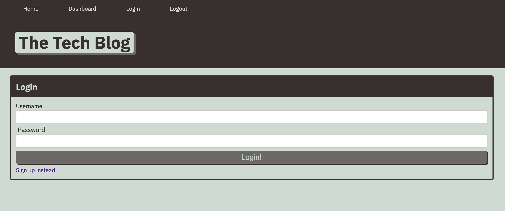
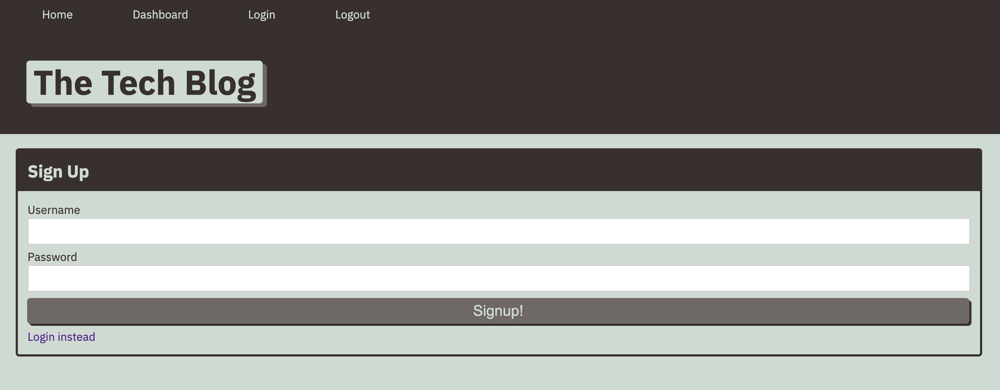
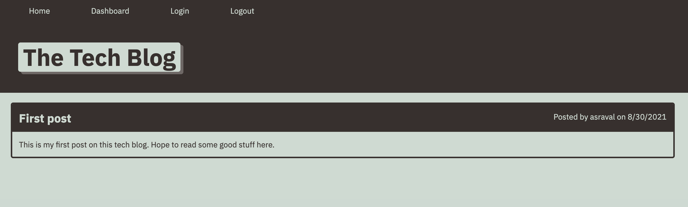
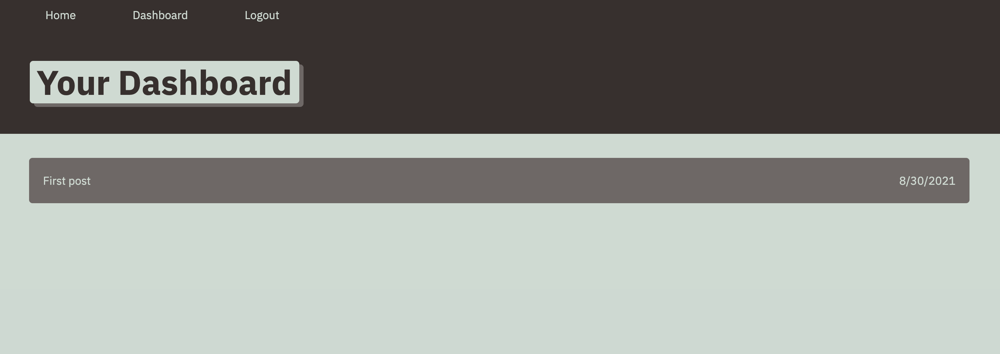

# Tech Blog
Tech Blog is a CMS-style blog site, where developers can publish their blog posts and comment on other developers’ posts as well.  
Checkout my app here - https://alap-tech-blog.herokuapp.com/

## Table of Contents
1. [Dependencies](#dependencies)
2. [Installation](#installation)
3. [Usage](#usage)
4. [Contributions](#contributions)
5. [Contact](#contact)
6. [License](#license)
7. [Screenshots](#screenshots)

## Getting Started
### Dependencies
node, npm, express, dotenv, sequelize

### Installation
`npm install`

Add .env file to your local repo and store your MySQL credentials using the following format:  
```sql
DB_NAME=tech_blog_db  
DB_PASSWORD=YOUR_PASSWORD  
DB_USER=YOUR_USERNAME
```

Run the following query in MySQL workbench to create `tech_blog_db` database.
```sql
DROP DATABASE IF EXISTS tech_blog_db;
CREATE DATABASE tech_blog_db;
```

### Usage
`npm start`

## Contributions
Pull requests are welcome. For major changes, please open an issue first to discuss what you would like to change.

### Current contributors
None 

## Contact
Checkout my [GitHub](https://github.com/alapsraval).

For additional questions, feel free to reach out to me at alapsraval@gmail.com.

## License
Copyright &copy; Alap Raval. All rights reserved.

Licensed under the [MIT](https://opensource.org/licenses/MIT) license.

## Screenshots




